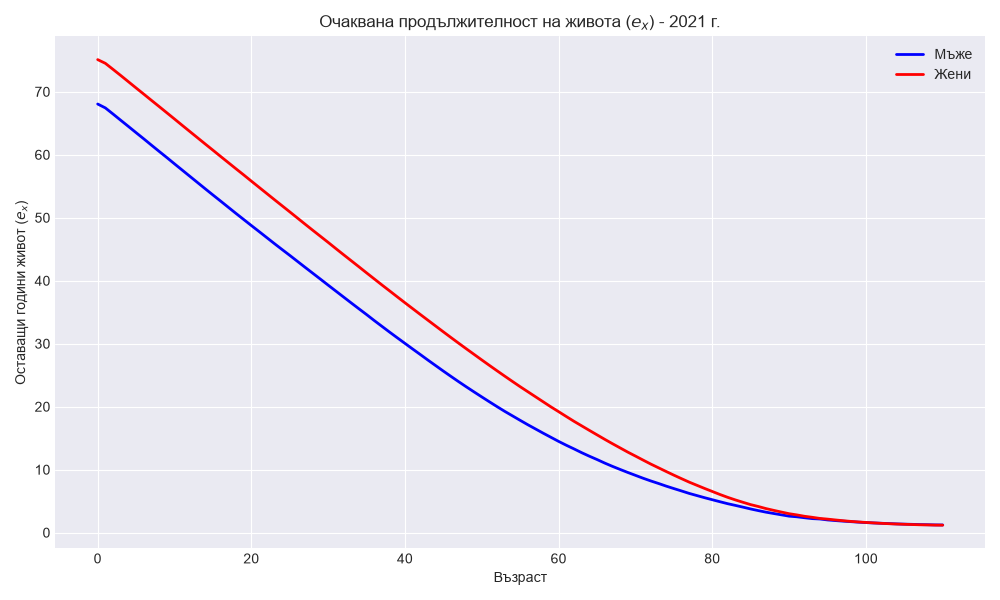
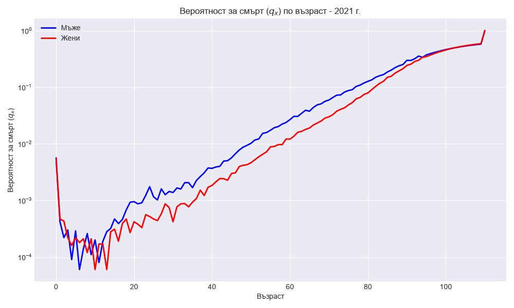

# mortality-data-analysis
Python project calculating Net Single Premium for Term Life Insurance using demographic mortality tables from HMD

# Actuarial Life Insurance Pricing Model

## Project Overview
This project calculates the **Net Single Premium (NSP)** for a Term Life Insurance policy. It demonstrates the application of actuarial science, demographic data analysis, and the time value of money (discounting) to determine the exact mathematical cost of life insurance risk.

## Data Source
The model uses 1x1 mortality tables (single-year age intervals and single calendar year data) for 2021.
* **l_x**: Number of survivors at exact age x.
* **d_x**: Number of deaths between age x and x+1.

## Mathematical Standard: Principle of Equivalence
In actuarial science, the pricing is based on the **Principle of Equivalence**: the expected present value of the benefits paid by the insurer must equal the expected present value of the premiums paid by the insured.

To calculate the cost for an n-year Term Life policy for a person aged x, we discount the expected payout for each year t using the technical interest rate i:

NSP = \sum_{t=0}^{n-1} S \times \left( \frac{d_{x+t}}{l_x} \right) \times v^{t+1}

Where:
* **S** = Sum Assured (e.g., 100,000 BGN)
* **v** = Discount factor 1 / (1 + i)

## Visualizations

### 1. Life Expectancy ($e_x$)
As expected, female life expectancy is structurally higher than male life expectancy across all ages.

### 2. Mortality Rate ($q_x$) - Log Scale
The logarithmic scale reveals the "accident hump" for males in their early 20s and the exponential growth of mortality risk after age 40 (Gompertz-Makeham law).

## Tech Stack

* **Python** (Core logic and mathematical modeling)
* **pandas** (Data extraction and wrangling)
